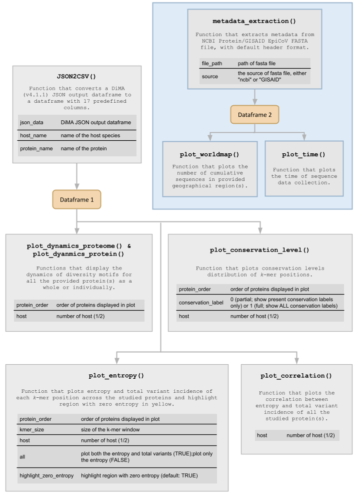

# vDiveR

<!-- badges: start -->

[](https://CRAN.R-project.org/package=vDiveR)
[](https://github.com/pendy05/vDiveR/actions/workflows/R-CMD-check.yaml)

<!-- badges: end -->

To ease the visualization of outputs from Diversity Motif Analyser ('DiMA';
<https://github.com/PU-SDS/DiMA>). 'vDiveR' allows visualization of the diversity
motifs (index and its variants – major, minor and unique) for elucidation of
the underlying inherent dynamics. Please refer <https://vdiver-manual.readthedocs.io/en/latest/>
for more information.

## Installation

```r
# install vDiveR:
install.packages("vDiveR")

#  Or the development version from GitHub:
# install.packages("devtools")
devtools::install_github("pendy05/vDiveR")

```

## VDiveR Functions Overview

<p align="center">

</p>
Figure 1: vDiveR functions. In the image above, purpose of each function together with its main arguments is shown. The dataframe returned from the respective functions are colored in orange.
